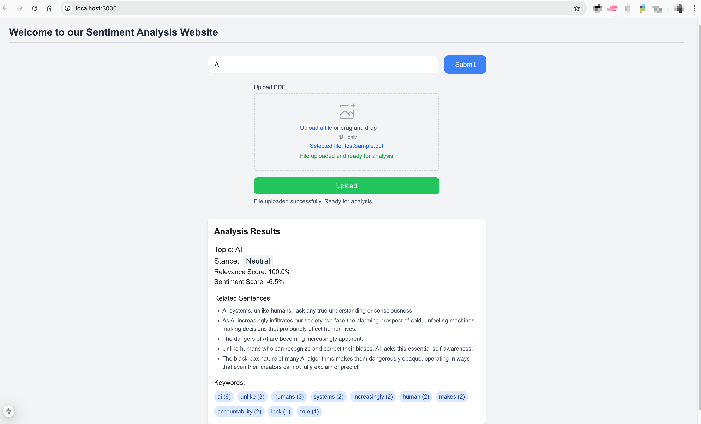

# Sentiment Analysis Project

## Project Overview
This project provides a comprehensive sentiment analysis solution with a modern web interface for analyzing PDF documents. The system can determine sentiment towards specific topics in uploaded documents and extract relevant keywords and sentences.



## Read our wiki
- [Design](https://git.ecdf.ed.ac.uk/psd2425/Rose-Campbell/sentiment-analysis/-/wikis/Design)
- [Planning](https://git.ecdf.ed.ac.uk/psd2425/Rose-Campbell/sentiment-analysis/-/wikis/Planning)
- [Implementation](https://git.ecdf.ed.ac.uk/psd2425/Rose-Campbell/sentiment-analysis/-/wikis/Implementation)

## System Architecture
The project is built as a monorepo using Turborepo to manage multiple services:

1. **Frontend**: Next.js application that provides the user interface
2. **Backend**: Flask-based API service that performs the sentiment analysis

### Architecture Diagram
```
┌─────────────────┐         ┌─────────────────┐         ┌─────────────────┐
│                 │         │                 │         │                 │
│    Frontend     │ ──────► │     Backend     │ ──────► │  GROBID Service │
│   (Next.js)     │         │    (Flask)      │         │  (PDF Parser)   │
│                 │         │                 │         │                 │
└─────────────────┘         └─────────────────┘         └─────────────────┘

```

## Key Features
- Upload and analyze PDF documents
- Perform topic-focused sentiment analysis
- Extract relevant sentences and keywords
- Visual representation of sentiment results

## Getting Started

### Prerequisites
- Node.js 18.0+
- Python 3.8+
- Docker (for GROBID service)

### Setup Steps

1. **Clone the repository**
```bash
git clone https://git.ecdf.ed.ac.uk/psd2425/Rose-Campbell/sentiment-analysis.git
cd sentiment-analysis
```

2. **Start the GROBID service** (required for PDF processing)
```bash
cd apps/backend/grobid_deployment && chmod +x deploy-grobid.sh
./deploy-grobid.sh
```

3. **Set up the backend**
```bash
cd apps/backend && chmod +x start_conda.sh
./start_conda.sh
```

4. **Set up the frontend**
```bash
cd apps/frontend
npm install
npm run dev
```

5. **Access the application**
- Frontend: http://localhost:3000
- Backend API: http://localhost:5000
- GROBID Service: http://localhost:8070

## Directory Structure
```
sentiment-analysis/
├── apps/
│   ├── frontend/               # Next.js frontend application
│   └── backend/                # Flask backend service
├── packages/                   # Shared packages and utilities
├── README.md                   # This file
└── package.json                # Root package.json for Turborepo
```

## Detailed Documentation
For more detailed information about each component:

- [Frontend Documentation](apps/frontend/README.md)
- [Backend Documentation](apps/backend/README.md)